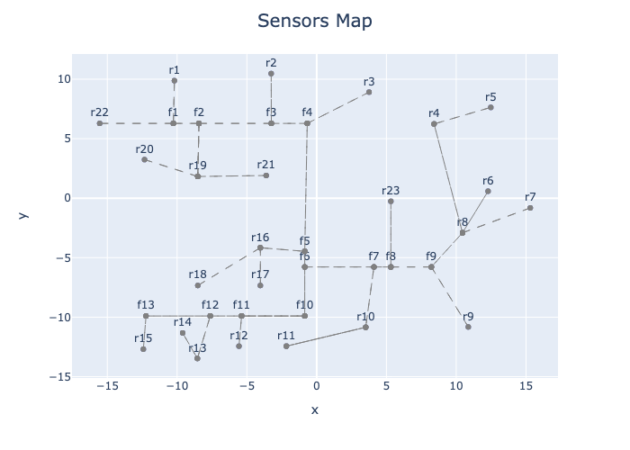
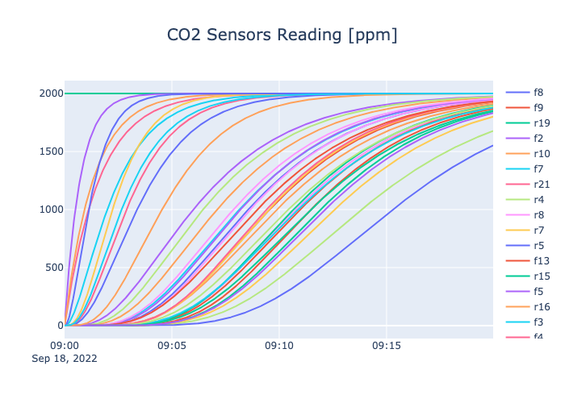

# HackZurich 2022 - EscapePros
By EscapeBros

[HackZurich 2022](https://hackzurich.com/)

Challenge: [#7 Siemens – From Paper to 4D Buildings](https://hackzurich.siemens.cool/#/SI_Challenge)

Creatorspace: https://app.creatorspace.dev/fabrizio/projects/Z6bdSq9NoIwJqWGt


## EscapePro

> There when it counts

EscapePro provides building users with real-time evacuation information in emergency situation, like: 
- Fires
- Flooding
- Active Shooters

## Getting started
Clone the repository and install the required packages, including the synthetic data package (in editable mode) by typing the following commands: 

```
git clone https://github.com/matteobe/hackzurich2022.git escapepro
cd escapepro
python3 -m virtualenv .venv
source .venv/bin/activate
pip install requirements.txt
pip install -e .
```

## Generate "Emergency" sensor data
Generate data for a fire propagating through a building and how it's being detected by CO2 sensors on the floor. 
The CO2 concentration spreads to adjacent rooms based on their distance and quantity of smoke present in the originating
room. Use the `escapepro` CLI to generate the dataset:

```
escapepro emergency --scenario fire
```

The CLI will create two files, a CSV file containing a wide-format file store of the simulated sensor data (column name 
corresponds to the node where the sensor is located), and a JSON file, containing the same data for easier ingestion into 
the Unity game engine.
The CLI will also open a figure showing the network of nodes and the sensor timeseries. The example below shows the 
output of the CLI.

 


## Generate "Normal Operations" data
To generate uncorrelated sensor data with seasonality patterns, you can use the `escapepro` CLI. 

```
escapepro normal
```

The command will generate a table of periodic sensor data for multiple sensors.

## Content

### SiemensData/

Sensordata and floordata-samples

### SiemensUnity/

Containing the Unity Project with the animated 3D floorplan.
